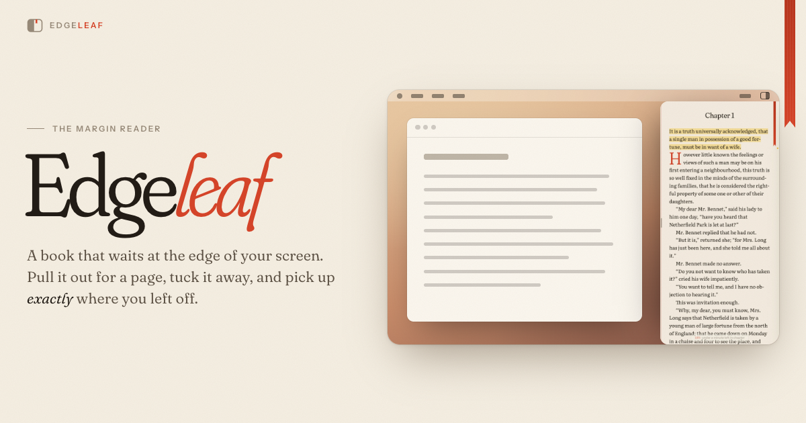

# Edgeleaf

**A book that waits at the edge of your screen.**

Edgeleaf is a free desktop reader for Mac and Windows. It stays tucked away at the edge of your
screen until you want it. Pull it out for a page, tuck it away, and pick up exactly where you
left off.

**[Download Edgeleaf](https://harshit-bisht1.github.io/edgeleaf)** ·
[Try it in your browser](https://harshit-bisht1.github.io/edgeleaf/#try) ·
[All releases](https://github.com/harshit-bisht1/edgeleaf/releases)

## How it works

- **Summon it from anywhere.** Press **⌥⇧B** (Alt+Shift+B on Windows) and Edgeleaf slides out
  over whatever you're doing, even a full-screen app. Press it again and it's gone.
- **Or rest on the edge.** Leave your cursor on the screen edge and a small tab peeks out with
  the book you're reading. Click it to open.
- **Click away to tuck it.** Go back to your work and Edgeleaf slips out of sight, keeping your
  place to the paragraph.

## Features

- EPUB, PDF and plain-text books, as one continuous scroll with no page turns
- Typeset like a book: chapters open with a drop cap and a small-caps first line
- Highlights in four colours, notes, a notebook for every book, and a mark where you stopped
- Define any word, from your Mac's dictionary or Wiktionary
- Your own shelves, an automatic "by genre" view, and sets that bind a series into one
- Mark books as reading, finished or set aside, and act on many at once
- Fix the text without touching the file: correct a typo, mend a broken paragraph, or remove
  every page number and site notice in a book at once
- Four themes (paper, sepia, dusk and night), typefaces made for long reading, and auto-scroll
- Docks on the left or right, at a quarter, a third or half of the screen; pin it open if you like

## Opening it for the first time

**Mac.** Edgeleaf isn't signed with an Apple developer certificate yet, so macOS asks you to
confirm it once:

1. Open the `.dmg`, drag **Edgeleaf** into **Applications**, then open it.
2. macOS says it can't check the app. Click **Done**.
3. Open **System Settings → Privacy & Security**, scroll down and click **Open Anyway**.

**Windows.** Run the `-setup.exe`. If Windows shows "Windows protected your PC", click
**More info**, then **Run anyway**.

Edgeleaf then lives in your menu bar (Mac) or system tray (Windows). Its icon turns to an
outline while it's tucked away.

## Privacy

Edgeleaf has no account and collects nothing. Your books, highlights and notes stay on your
computer. When you look up a word your Mac's dictionary doesn't know, that one word is sent to
Wiktionary.

## Support

Edgeleaf is free: no trial, no ads, no account. If it earns a place at the edge of your screen,
you can [buy me a coffee on Ko-fi](https://ko-fi.com/edgeleaf).

---

This repository holds Edgeleaf's download page and releases.

© 2026 Harshit Bisht. All rights reserved. Edgeleaf is free to download and use, but it isn't
open source; see the [terms](LICENSE.txt). It's built with Tauri, pdf.js and other open-source
software, whose licences are inside the app under "Acknowledgements".
